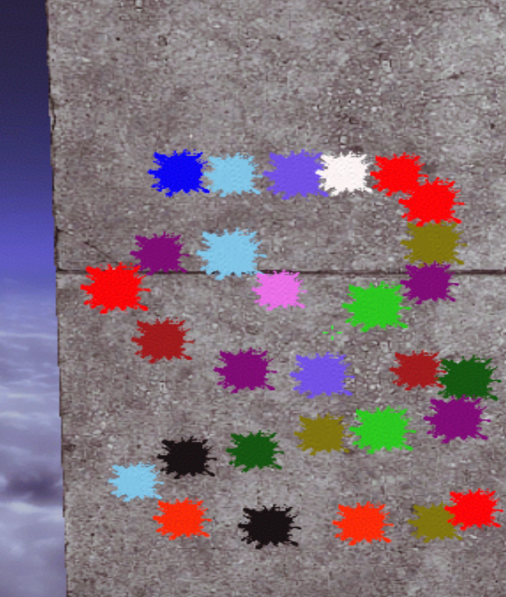

# Frostline Paintball for CS2

Frostline Paintball is a CounterStrikeSharp plugin that turns normal bullet impacts into colored paint splats in Counter-Strike 2.

Like the classic [Paintball plugin for Counter-Strike: Source and CS:GO](https://forums.alliedmods.net/showthread.php?t=107012), it listens for every `bullet_impact` and places a randomly colored decal at the hit position. This version was rebuilt for Source 2 using `env_decal` entities and CounterStrikeSharp surface tracing, allowing splats to align correctly on floors, walls, ceilings and slopes.

## Preview



## Features

- Colored paint splats on bullet impacts
- Correct alignment on floors, walls, ceilings and slopes
- Random color and configurable size for every impact
- 14 included colors
- Configurable maximum number of active decals
- Oldest decals are removed first when the limit is reached
- Optional cleanup at the beginning of every round
- Automatically generated CounterStrikeSharp configuration
- Optional bot support

## Included colors

Baby Blue, Black, Blue, Brown, Dark Green, Golden Rod, Lime Green, Medium Slate Blue, Olive, Purple, Red, Red Orange, Violet and White.

Each color can be enabled or disabled separately in the configuration file.

## Requirements

- Metamod:Source
- CounterStrikeSharp API 372 or newer with .NET 10 support
- MultiAddonManager
- The Frostline Paintball material addon mounted through the CS2 Workshop

CS2 does not download arbitrary custom materials directly from a game server. The included Source 2 materials must therefore be delivered through a Workshop addon and mounted for the server and connecting players.

## Installation

1. Download `Frostline-Paintball-CS2.zip` from the latest GitHub release.
2. Copy the contents of the `server` directory into the server's `game/csgo` directory.
3. Mount the Frostline Paintball Workshop asset addon with MultiAddonManager. If the public Workshop item is not available, build and publish your own copy from `assets/content` using the CS2 Workshop Tools.
4. Add the Workshop item ID to:

```text
game/csgo/cfg/multiaddonmanager/multiaddonmanager.cfg
```

Example:

```text
mm_extra_addons "YOUR_WORKSHOP_ID"
```

5. Restart the server or change the map after mounting the addon so the materials are precached.

The plugin files should end up in:

```text
game/csgo/addons/counterstrikesharp/plugins/FrostlinePaintball/
```

## Configuration

CounterStrikeSharp creates the configuration automatically after the plugin starts:

```text
game/csgo/addons/counterstrikesharp/configs/plugins/FrostlinePaintball/FrostlinePaintball.json
```

| Setting | Default | Description |
| --- | ---: | --- |
| `Enabled` | `true` | Enables or disables the plugin. |
| `IncludeBots` | `true` | Creates paint splats for bot shots. |
| `ClearOnRoundStart` | `true` | Removes all paint splats when a new round starts. |
| `MaxActiveDecals` | `256` | Maximum number of paint splats kept at the same time. |
| `MinSize` | `7.0` | Smallest possible random splat size. |
| `MaxSize` | `12.0` | Largest possible random splat size. |
| `ProjectionDepth` | `5.0` | Depth of the projected decal volume. |
| `SurfaceOffset` | `0.35` | Distance between the decal and the hit surface. |
| `RenderOrder` | `1` | Decal rendering order. |

Set `MinSize` and `MaxSize` to the same value if every paint splat should have an identical size.

Decals are removed at the start of each round by default. If more than `MaxActiveDecals` impacts exist during a round, the oldest decal is removed whenever a new one is created.

## Configuring build paths

Both build scripts in `tools/` read their settings from `tools/BuildConfig.jsonc`, so you can set your local paths once instead of passing command-line switches every time. Open that file and edit the values to match your machine:

| Setting | Default | Description |
| --- | --- | --- |
| `Cs2Root` | *(empty)* | Root of your CS2 install — the folder that directly contains `content\csgo_addons\...` and `game\bin\win64\resourcecompiler.exe`. Required for `Compile-Assets.ps1`; leave empty to require `-Cs2Root` on the command line instead. |
| `AddonName` | `frostline_paintball_assets` | Name of the local Workshop Tools addon that holds the compiled paint materials. |
| `PluginFolderName` | `FrostlinePaintball` | Folder name the plugin ships under. Must match the compiled assembly name (`AssemblyName` in the `.csproj`), since CounterStrikeSharp loads plugins from `addons\counterstrikesharp\plugins\<PluginFolderName>\<PluginFolderName>.dll`. |
| `ReleaseDir` | `release` | Directory (relative to the project root, unless you give an absolute path) that collects all build output before you copy it to a real server. |
| `ReleasePluginParentSubdir` | `server/addons/counterstrikesharp/plugins` | Path under `ReleaseDir` where the ready-to-copy plugin folder is written. |
| `ReleaseWorkshopSubdir` | `workshop-addon` | Path under `ReleaseDir` where compiled workshop addon content is collected. |

Every setting can also be overridden per-run with a matching command-line parameter. Precedence is: **command-line param > `BuildConfig.jsonc` > built-in default**. For example, to build against a different CS2 install just for one run without touching the config file:

```powershell
.\tools\Compile-Assets.ps1 -Cs2Root "G:\SteamLibrary\steamapps\common\Counter-Strike Global Offensive"
```

You can also point either script at a completely different config file with `-ConfigPath`:

```powershell
.\tools\Build-PluginRelease.ps1 -ConfigPath "C:\configs\BuildConfig.dev.jsonc"
```

`Cs2Root` is the only setting that must be provided one way or another (config file or `-Cs2Root`); everything else already has a working default.

## Building the plugin

```powershell
.\tools\Build-PluginRelease.ps1
```

This runs `dotnet build` for `src/FrostlinePaintball/FrostlinePaintball.csproj` and copies the compiled `.dll`, `.deps.json` and `.pdb` into the release plugin folder. Pass `-Configuration Debug` to build a Debug build instead of the default `Release`.

The deployable plugin is written to (using the default config):

```text
release/server/addons/counterstrikesharp/plugins/FrostlinePaintball/
```

If you change `ReleaseDir` or `ReleasePluginParentSubdir` in `BuildConfig.jsonc`, the output moves accordingly.

## Building the Source 2 materials

Install the Counter-Strike 2 Workshop Tools and run:

```powershell
.\tools\Compile-Assets.ps1
```

(or pass `-Cs2Root` directly if you haven't set it in `BuildConfig.jsonc`, as shown above).

The script creates a local Workshop Tools addon (named `AddonName` from the config, `frostline_paintball_assets` by default) and places a portable compiled copy in `release/workshop-addon` (or wherever `ReleaseDir`/`ReleaseWorkshopSubdir` point). Re-running the script only adds and overwrites the compiled materials it produces — it won't delete other files you've placed in the addon or release folders.

## Troubleshooting

### Missing `.vmat_c` resources

The Workshop addon is not mounted, has not finished downloading or contains an older build. Verify the Workshop ID in MultiAddonManager, update the Workshop item and restart the server or change the map.

### Colored rectangles instead of paint splats

The client is loading an outdated material build. Update the Workshop addon and make sure old compiled texture files are not included.

### Plugin does not load

Update CounterStrikeSharp to API 372 or newer. The surface tracing used by the plugin is provided by CounterStrikeSharp.

## Credits

Inspired by the original [SourceMod Paintball plugin](https://forums.alliedmods.net/showthread.php?t=107012) for Counter-Strike: Source and CS:GO.

## License

MIT
